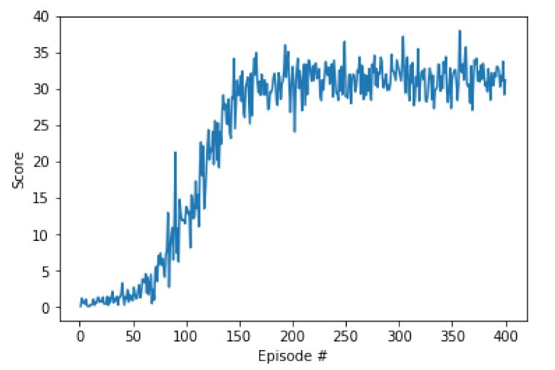

[//]: # (Image References)

[image1]: https://user-images.githubusercontent.com/10624937/43851024-320ba930-9aff-11e8-8493-ee547c6af349.gif "Trained Agent"
[image2]: https://user-images.githubusercontent.com/10624937/43851646-d899bf20-9b00-11e8-858c-29b5c2c94ccc.png "Crawler"


# Project: Continuous Control

## Introduction

For this project, you will work with the [Reacher](https://github.com/Unity-Technologies/ml-agents/blob/master/docs/Learning-Environment-Examples.md#reacher) environment.

![Trained Agent][image1]

In this environment, a double-jointed arm can move to target locations. A reward of +0.1 is provided for each step that the agent's hand is in the goal location. Thus, the goal of your agent is to maintain its position at the target location for as many time steps as possible.

The observation space consists of 33 variables corresponding to position, rotation, velocity, and angular velocities of the arm. Each action is a vector with four numbers, corresponding to torque applicable to two joints. Every entry in the action vector should be a number between -1 and 1.

### Distributed Training

For this project, we will provide you with the version of the Unity environment that contains a single agent.

#### Option 1: Solve the First Version

The task is episodic, and in order to solve the environment,  your agent must get an average score of +30 over 100 consecutive episodes.

The environment is considered solved, when the average (over 100 episodes) of those average scores is at least +30. 

## Installation & Dependencies

1. Installing Anaconda (https://www.anaconda.com/).

   The dependencies for this project can be installed by following the instructions at https://github.com/udacity/deep-reinforcement-learning#dependencies.  Required components include Python 3.6 (My Python version: 3.6.3), and PyTorch v0.4 (My Torch  version 1.8.1), and the Unity ML-Agents toolkit.

   Unity Machine Learning Agents (ML-Agents) is an open-source Unity plugin that enables games and simulations to serve as environments for training intelligent agents.

   To set up your python environment to run the code in this repository, follow the instructions below.

2. Create (and activate) a new environment with Python 3.6.

	- __Linux__ or __Mac__: 
	```bash
	conda create --name drlnd python=3.6
	source activate drlnd
	```
	- __Windows__: 
	```bash
	conda create --name drlnd python=3.6 
	activate drlnd
	```

3. Follow the instructions in [this repository](https://github.com/openai/gym) to perform a minimal install of OpenAI gym.  
	- Next, install the **classic control** environment group by following the instructions [here](https://github.com/openai/gym#classic-control).
	- Then, install the **box2d** environment group by following the instructions [here](https://github.com/openai/gym#box2d).
	
4. Clone the repository (if you haven't already!), and navigate to the `python/` folder.  Then, install several dependencies.
```bash
git clone https://github.com/udacity/deep-reinforcement-learning.git
cd deep-reinforcement-learning/python
pip install .
```

   The original files from the project can be found in the folder `deep-reinforcement-learning\p2_continuous-control`

5. Copy the folder for this project

   The folder is named p2_continuous-control.

6. Download the Unity environment for this project

   6.1. Download the environment from one of the links below.  You need only select the environment that matches your operating system:

- **_Version 1: One (1) Agent_**
  - Linux: [click here](https://s3-us-west-1.amazonaws.com/udacity-drlnd/P2/Reacher/one_agent/Reacher_Linux.zip)
  - Mac OSX: [click here](https://s3-us-west-1.amazonaws.com/udacity-drlnd/P2/Reacher/one_agent/Reacher.app.zip)
  - Windows (32-bit): [click here](https://s3-us-west-1.amazonaws.com/udacity-drlnd/P2/Reacher/one_agent/Reacher_Windows_x86.zip)
  - Windows (64-bit): [click here](https://s3-us-west-1.amazonaws.com/udacity-drlnd/P2/Reacher/one_agent/Reacher_Windows_x86_64.zip)

_For Windows users_) Check out [this link](https://support.microsoft.com/en-us/help/827218/how-to-determine-whether-a-computer-is-running-a-32-bit-version-or-64) if you need help with determining if your computer is running a 32-bit version or 64-bit version of the Windows operating system.

(_For AWS_) If you'd like to train the agent on AWS (and have not [enabled a virtual screen](https://github.com/Unity-Technologies/ml-agents/blob/master/docs/Training-on-Amazon-Web-Service.md)), then please use [this link](https://s3-us-west-1.amazonaws.com/udacity-drlnd/P2/Reacher/one_agent/Reacher_Linux_NoVis.zip) (version 1) or [this link](https://s3-us-west-1.amazonaws.com/udacity-drlnd/P2/Reacher/Reacher_Linux_NoVis.zip) (version 2) to obtain the "headless" version of the environment.  You will **not** be able to watch the agent without enabling a virtual screen, but you will be able to train the agent.  (_To watch the agent, you should follow the instructions to [enable a virtual screen](https://github.com/Unity-Technologies/ml-agents/blob/master/docs/Training-on-Amazon-Web-Service.md), and then download the environment for the **Linux** operating system above._)

   6.2. Place the file in the DRLND GitHub repository, in the `p2_continuous-control/` folder, and unzip (or decompress) the file. 

   The Jupyter notebook for running the code is called `Continuous_Control.ipynb`.

7. Create an [IPython kernel](http://ipython.readthedocs.io/en/stable/install/kernel_install.html) for the `drlnd` environment.  
```bash
python -m ipykernel install --user --name drlnd --display-name "drlnd"
```

8. Before running code in a notebook, change the kernel to match the `drlnd` environment by using the drop-down `Kernel` menu. 

[](https://user-images.githubusercontent.com/10624937/42386929-76f671f0-8106-11e8-9376-f17da2ae852e.png)

These steps only need to be performed once. 

### Instructions

The detailed instructions are in `Continuous_Control.ipynb` and `Report.pdf` to get started with training your own agent!  

(_For AWS_) If you'd like to train the agent on AWS (and have not [enabled a virtual screen](https://github.com/Unity-Technologies/ml-agents/blob/master/docs/Training-on-Amazon-Web-Service.md)), then please use [this link](https://s3-us-west-1.amazonaws.com/udacity-drlnd/P2/Crawler/Crawler_Linux_NoVis.zip) to obtain the "headless" version of the environment.  You will **not** be able to watch the agent without enabling a virtual screen, but you will be able to train the agent.  (_To watch the agent, you should follow the instructions to [enable a virtual screen](https://github.com/Unity-Technologies/ml-agents/blob/master/docs/Training-on-Amazon-Web-Service.md), and then download the environment for the **Linux** operating system above._)

### Examine the State and Action Spaces
In this environment, a double-jointed arm can move to target locations. A reward of +0.1 is provided for each step that the agent's hand is in the goal location. Thus, the goal of your agent is to maintain its position at the target location for as many time steps as possible.
The observation space consists of 33 variables corresponding to position, rotation, velocity, and angular velocities of the arm. Each action is a vector with four numbers, corresponding to torque applicable to two joints. Every entry in the action vector must be a number between -1 and 1.
Run the code cell below to print some information about the environment.

### Actor (Policy) Model
Maps states to action values. The actor network has the following structure:

* fully connected layer (state size x 128)
* SELU-activation
* fully connected layer (128 x 64)
* SELU-activation
* fully connected layer (64 x 32)
* SELU-activation
* fully connected layer (32 x action size)

### Critic (Value) Model
Maps (state, action) pairs to Q-values. The critic network has the following structure:
* fully connected layer (state size x 128)
* SELU-activation
* concatenate the action
* fully connected layer (128 + action size x 64)
* SELU-activation
* fully connected layer (64 x 32)
* SELU-activation
* fully connected layer (32 x 1)

### Agent parameters:
```
state_size  : environmen state size
action_size : action size
num_agents  : # learning agents
andom_seed  : random seed number (optional)
batch_size  : minibatch size for neural network training
lr_actor    : actor neural network learning rate
lr_critic   : critic neural network learning rate
noise_theta : parameter theta for Ornstein-Uhlenbeck noise process
noise_sigma : parameter sigma for Ornstein-Uhlenbeck noise process
actor_fc1   : # nodes in first hidden layer for actor
actor_fc2   : # nodes in second hidden layer for actor
actor_fc3   : # nodes in the third hidden layer for actor
critic_fc1  : # nodes in first hidden ayer for critic
critic_fc2  : # nodes in second hidden layer for critic
critic_fc3  : # nodes in the third hidden layer for critic
update_every: # time steps between each updating neural networks 
num_updates : # times to update the networks at every update_every interval
buffer_size : buffer size for experience replay
```
The plot of rewards per episode is included to illustrate that the agent is able to receive an average reward (over 100 episodes) of at least +30.


